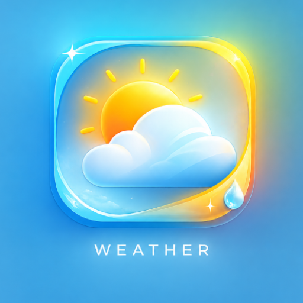
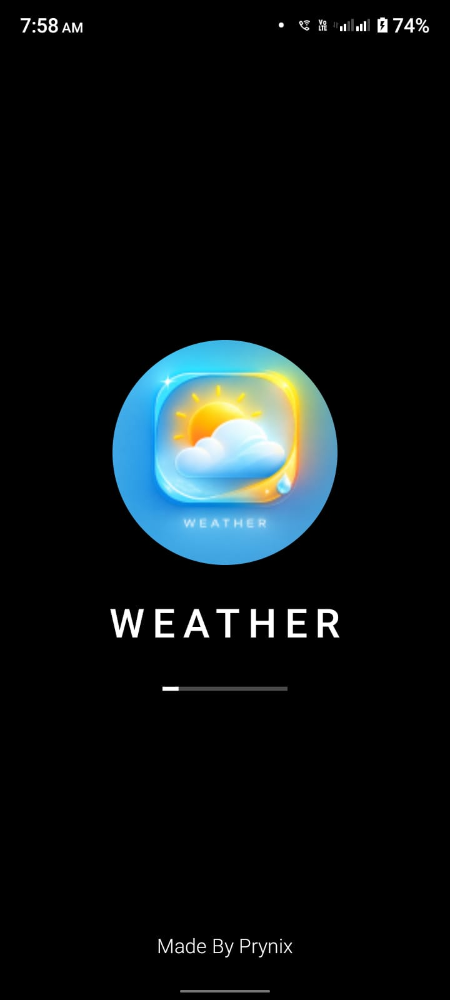
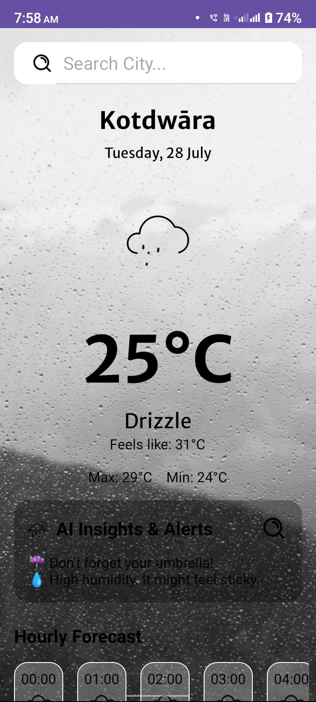
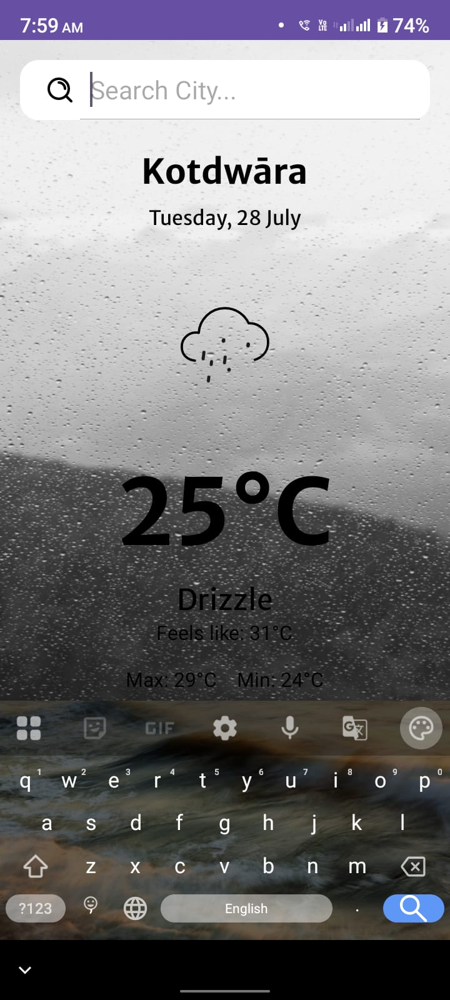
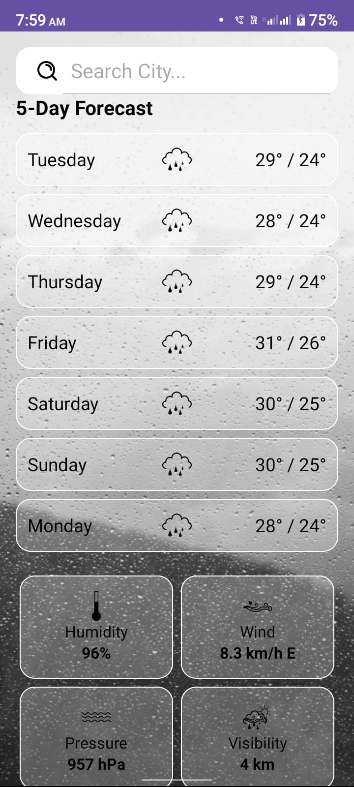
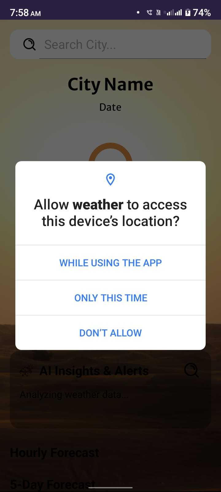

# 🌦️ Weather App

<p align="center">
  
</p>

<h1 align="center">Weather App</h1>

<p align="center">
A modern Android Weather Application built with Kotlin and Android Studio.
</p>

<p align="center">

🌤️ Real-Time Weather • 📍 Current Location • 📅 5-Day Forecast • 🤖 AI Weather Insights

</p>

---

# 📱 App Preview

| Splash Screen | Home Screen |
|---------------|-------------|
|  |  |

| Search City | Forecast |
|-------------|----------|
|  |  |

<p align="center">

</p>

---

# ✨ Features

- 🌍 Search weather by city
- 📍 Current Location Weather
- 🌡️ Real-Time Temperature
- 🌥️ Weather Conditions
- 💧 Humidity
- 🌬️ Wind Speed
- 🌡️ Pressure
- 👀 Visibility
- 📅 5-Day Forecast
- ⏰ Hourly Forecast
- 🤖 AI Weather Insights
- 🎨 Dynamic Weather Background

---

# 🛠 Tech Stack

- Kotlin
- Android Studio
- XML
- Retrofit
- RecyclerView
- OpenWeather API
- Material Design

---

# 🚀 Installation

```bash
git clone https://github.com/viramnegi123-lang/Weather-App.git
```

Open Android Studio

Sync Gradle

Run the App

---

# 📂 Project Structure

```
Weather-App
│
├── app
├── gradle
├── README.md
└── build.gradle.kts
```

---

# 🔮 Upcoming Features

- 🌙 Dark Mode
- ⭐ Favorite Cities
- 🌍 Multi Language
- 📈 Air Quality Index
- 🔔 Weather Alerts
- 📡 Offline Cache

---

# 👨‍💻 Developer

### Priyanshu Negi

Android Developer

GitHub:
https://github.com/viramnegi123-lang

---

# ⭐ Show Your Support

If you like this project,

⭐ Star this repository

🍴 Fork this repository

❤️ Follow me on GitHub

---

# 📄 License

This project is open for learning and portfolio purposes.
